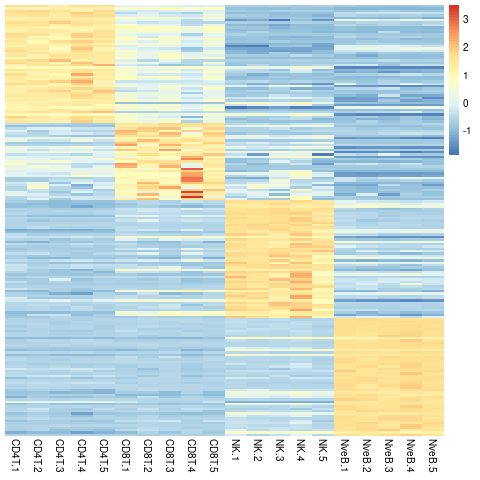

# CreateGeneSignatures


## Introduction

This package creates per-group marker signatures from pairwise differential expression (DE) results. For this it expects a list of DE result tables (data.frames) for all possible pairwise combinations of groups. For example, for three groups A, B and C that would be A-B, A-C and B-C. It first subsets these DE results to "significant" genes based on user-defined cutoffs, for example based on FDR and logFC. It then ranks these DE results by a user-defined metric, such as `-log10(pvalue)` and then aggregates the results into ranked list of markers per group, see `?RankDEGs`. Based on these lists the `CreateGeneSignatures()` function then filters for genes that are DE in a given groups versus a proportion (`min.prop`) of other groups, for example 1 means all groups, and 0.75 means 75% of other groups. The ranking of the per-group markers is based on the chosen ranking metric. Gene rank highly if they consistently ranked highly in the individual DE tables.

The aim of this package is simplicity and understandable "non-blackbox" behaviour. Therefore, the marker criteria are simply "a gene must be DE with cutoffs (...) and for a given group this must be tre against (all, half, 3/4, ...) other groups.

## Example workflow:

The example workflow uses RNA-seq data from Haemopedia. It first perform differential analysis with `edgeR`,
then filters the DE results for significant genes, ranks the DEGs and then create a signature for every of the four celltypes, namely CD4-T cells, CD8-T cells, naive B cells and natural killer (NK) cells.

```{r}
# load RNA-seq data for CD4T-, CD8T and naive B cells from Haemopedia:
counts <- readRDS(paste0(
  system.file("extdata",package="CreateGeneSignatures"),
  "/haemopedia_subset.rds"))

# Use edgeR to perform all pairwise comparisons
library(edgeR)

y <- DGEList(counts=counts,group=gsub("\\..", "", colnames(counts)))
design <- model.matrix(~0+group,y$samples)
colnames(design) <- gsub("group", "", colnames(design))
y <- y[filterByExpr(y),,keep.lib.size=FALSE]
y <- calcNormFactors(y)
y <- estimateDisp(y,design)
fit <- glmQLFit(y,design)

# all unique pairwise contrasts:
contrasts <- makeContrasts(CD4T_vs_CD8T  = CD4T-CD8T,
                           CD4T_vs_NK    = CD4T-NK,
                           CD4T_vs_NveB  = CD4T-NveB,
                           CD8T_vs_NK    = CD8T-NK,
                           CD8T_vs_NveB  = CD8T-NveB,
                           NK_vs_NveB    = NK-NveB,
                           levels = design)

# test using glmTreat                        
res <- sapply(colnames(contrasts), function(con){
  tt<-topTags(glmTreat(fit,contrast=contrasts[,con], log2(1.5)),n=Inf)$table
  return(data.frame(Gene=rownames(tt), tt))
}, simplify = FALSE)

# Rank the DEGs:
ranked <- RankDEGs(res, delim="_vs_", signif.column="FDR", signif.threshold=0.05,
                   effect.column="logFC", effect.threshold=0, gene.column="Gene",
                   rnk.column="PValue", rnk.method="increasing")

# Create signatures, keeping top 50 signature genes that separate the respective celltype from all other celltypes:
signatures <- CreateGeneSignatures(ranked=ranked, keep.n=50, min.prop=1)

# check number of genes. for CD8T cells we found < 50 genes:
lengths(signatures)

# Inspect signatures using heatmaps plotting the scaled logcpms of the signature genes
library(pheatmap)
logcpm <- log2(edgeR::cpm(y,log=FALSE)+1)

# plot a heatmap in the order of names(signatures)
col_order <- unlist(lapply(names(ranked), function(x) grep(paste0("^", x), colnames(logcpm))))

# use scaled logCPMs                           
logcpmZ <- t(scale(t(logcpm[unique(unlist(signatures)),])))
pheatmap(mat=logcpmZ[,col_order],
         show_rownames=FALSE, cluster_rows=FALSE, cluster_cols=FALSE)     
```

A heatmap of the combined signatures genes:



In the above example the parameters were most strict, with `min.prop=1` requiring that signature genes were DE in all comparisons. Alternatively, if this returns no, or too few genes one might relax this cutoff, for example `min.prop=0.75`, which requires that a gene is DE in at least 75% of comparisons. 

## Installation

```r
install.packages("remotes")
remotes::install_github("ATpoint/CreateGeneSignatures")
```
